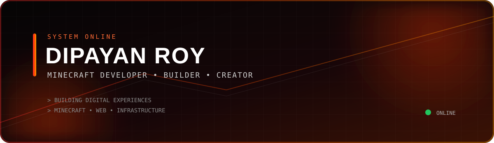

 

  

&nbsp;

&nbsp;

&nbsp;

&nbsp;

 

  

---

## 👨‍💻 About Me

> **Developer • Minecraft Enthusiast • Builder**

I'm **Dipayan Roy**, a developer who enjoys creating Minecraft
systems, web projects, Discord applications and server infrastructure.

I'm particularly interested in turning ideas into complete,
working projects — from the first line of code to deployment.

---

## 🚀 Featured Projects

<table>
<tr>

<td width="50%" align="center">

### 🎮 PhoenixLauncher

  

A custom Minecraft launcher project designed around a clean interface, customization and an improved Minecraft experience.

  

</td>

<td width="50%" align="center">

### ☁️ Nubilux

  

Minecraft hosting and infrastructure focused on server management, performance and reliable environments.

  

</td>

</tr>

<tr>

<td width="50%" align="center">

### ⚔️ Farlands

  

A multiplayer Minecraft network featuring custom gameplay, server systems and a unique player experience.

  

</td>

<td width="50%" align="center">

### 🛠️ DevKrew

  

A development ecosystem focused on websites, Discord systems, Minecraft projects and digital solutions.

  

</td>

</tr>
</table>

---

## 🔍 Explore My Work

<b>🎮 Minecraft Development</b>

 

Minecraft server development, plugins, gameplay systems, infrastructure and custom server experiences.

<b>🌐 Web Development</b>

 

Websites, dashboards, landing pages and web-based tools.

<b>🤖 Discord Development</b>

 

Discord bots, community systems, automation and server management tools.

<b>⚙️ Infrastructure</b>

 

Server hosting, deployment, configuration and Minecraft infrastructure.

---

## 🛰️ Currently Building

<table>
<tr>

<td width="50%" align="center">

### 🎮 PhoenixLauncher

  

Building a custom Minecraft launcher with a focus on customization, usability and Minecraft compatibility.

  

**Progress**

████████░░ 80%

</td>

<td width="50%" align="center">

### ☁️ Nubilux

  

Minecraft hosting and infrastructure focused on server deployment, management and performance.

  

**Status**

● Online & Developing

</td>

</tr>

<tr>

<td width="50%" align="center">

### ⚔️ Farlands

  

Minecraft multiplayer project focused on custom gameplay, server systems and community experience.

  

**Status**

● Active Development

</td>

<td width="50%" align="center">

### 🛠️ DevKrew

  

Development ecosystem for web, Discord and Minecraft-related projects.

  

**Status**

● Building

</td>

</tr>
</table>

---

## 🧠 What I'm Learning

___

## 🖥️ System Status

<table>
<tr>
<td width="50%">

### DEVELOPMENT

🟢 **Minecraft Development**  
`ACTIVE`

🟢 **Web Development**  
`ACTIVE`

🟡 **Launcher Development**  
`BUILDING`

</td>

<td width="50%">

### INFRASTRUCTURE

🟢 **Nubilux**  
`ACTIVE`

🟢 **Farlands**  
`ACTIVE`

🟡 **DevKrew**  
`BUILDING`

</td>
</tr>
</table>

 

## 🧩 Development Focus

<table>
<tr>
<td align="center">

<b>01</b> 
Minecraft Development

</td>
<td align="center">

<b>02</b> 
Server Infrastructure

</td>
<td align="center">

<b>03</b> 
Launcher Development

</td>
</tr>

<tr>
<td align="center">

<b>04</b> 
Web Development

</td>
<td align="center">

<b>05</b> 
Discord Systems

</td>
<td align="center">

<b>06</b> 
Project Building

</td>
</tr>
</table>

---

## ⚙️ Tech Stack

  

---

## 📊 GitHub Statistics

  

---

## 🐍 Contribution Activity

---

## 🌐 Connect With Me

 

## 💬 Discord Communities

<a href="https://discord.gg/5uuCPRsz3T">

